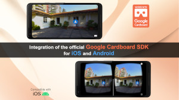
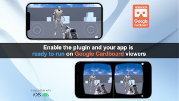
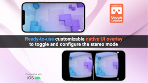
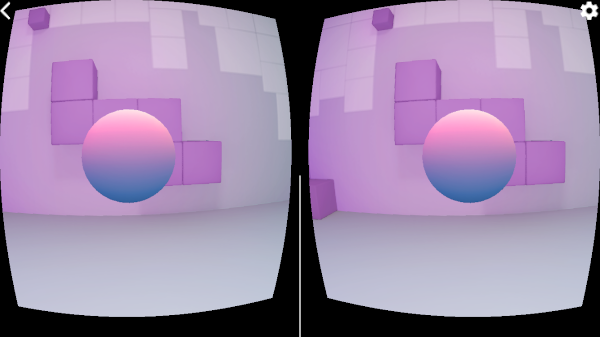
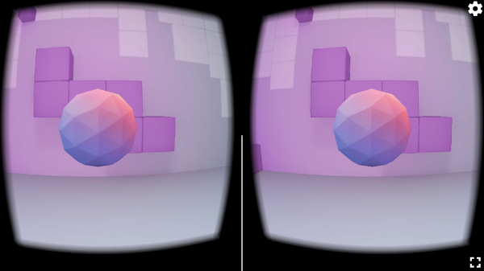

# UE5 Cardboard VR demo project

This project is a public demo of the plugin "*[UE5 Cardboard VR](https://unrealengine.com/marketplace/cardboard-vr)*" for Unreal Engine 5.
Specifically, this is a porting to Unreal Engine of the official new Google Cardboard SDK [native mobile demo](https://github.com/googlevr/cardboard), for iOS and Android.

*MARKETPLACE: <https://unrealengine.com/marketplace/cardboard-vr>*

**ATTENTION: a copy of the plugin is required to use this project.**

[UE5 Cardboard VR](https://unrealengine.com/marketplace/cardboard-vr) is an Unreal Engine 5 plugin to support [Google Cardboard VR headsets](https://arvr.google.com/cardboard/) on iOS and Android mobile platforms, integrating the new official Google Cardboard SDK.

*NOTE: this product is not made by, or affiliated with, Google Inc in any way.*

## Branches

The *master* branch contains the project for the latest available version of Unreal Engine.

You can find the old projects for the other supported versions of Unreal Engine in their dedicated *branches* in this repository.

## Links

Marketplace: <https://unrealengine.com/marketplace/cardboard-vr>

Documentation: <https://www.unamedia.com/ue5-cardboard/api/>

Discord server: <https://discord.gg/PuAyhDctHp>

Forum thread: <https://forums.unrealengine.com/unreal-engine/marketplace/1849407-cardboard-vr-google-cardboard-vr-headsets-on-ios-and-android-integrating-the-official-google-sdk>

## UE5 Cardboard VR - plugin

[UE5 Cardboard VR](https://unrealengine.com/marketplace/cardboard-vr) is an Unreal Engine plugin to run UE4 and UE5 mobile VR projects on iOS and Android devices using [Google Cardboard](https://arvr.google.com/cardboard/) viewers. The plugin integrates the new official [Google Cardboard SDK](https://github.com/googlevr/cardboard).

Simply enabling the plugin is enough to start building and running your mobile VR experience on any Google Cardboard supported mobile device and viewer.

For a complete setup, more advanced options and important technical notes, please read the [documentation](https://www.unamedia.com/ue5-cardboard/api/).

### Features

- head tracking;
- stereoscopic rendering;
- user interaction via the viewer button;
- native, customizable, UI overlay to allow the user to:
  - enable/disable the stereoscopic mode;
  - scan the QR code to automatically configure the parameters of its Google Cardboard viewer.
- all the features are available from both Blueprints and C++.

## Demo project

This demo project is a porting to Unreal Engine 5 of the official new Google Cardboard SDK [native mobile demo](https://github.com/googlevr/cardboard), for iOS and Android.

Thanks to the automatic *native overlay* feature provided out-of-the-box by the *UE5 Cardboard VR* plugin, the UE5 app can work both in stereo mode and in non-stereo mode, without requiring any change to the project code.

Screenshot from the official Google Cardboard SDK demo app:

Screenshots of the ported Unreal Engine 5 version, based on the *UE5 Cardboard VR* plugin:

